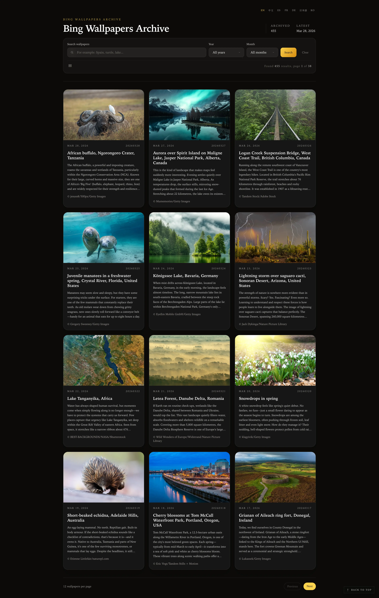
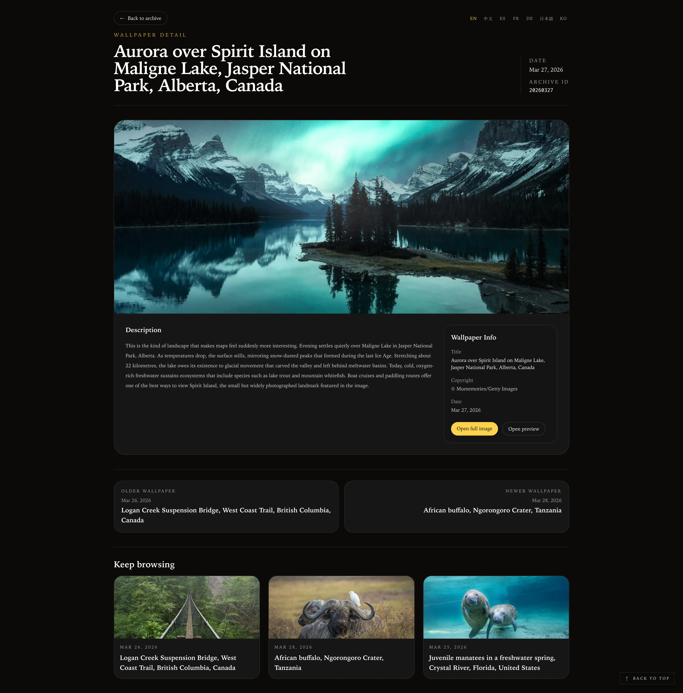

# Bing Wallpapers Archive

A multilingual Bing wallpaper archive built with Next.js, TypeScript, and SQLite/JSON storage.

Online preview: [https://bing.xc2f.com](https://bing.xc2f.com)

## Features

- Browse wallpapers in list view, detail view, and waterfall view
- Search by keyword and filter by year/month
- Multi-language UI routing with locale-aware pages

## Tech Stack

- Next.js 15 App Router
- React 19
- TypeScript
- Tailwind CSS
- SQLite + LowDB
- OpenNext Cloudflare deployment

## Local Development

Install dependencies:

```bash
npm install
```

Start the development server:

```bash
npm run dev
```

Open [http://localhost:3000](http://localhost:3000).

## Environment

Create `.env`:

```bash
BASE_URL=https://www.bing.com
```

`BASE_URL` is used as the Bing upstream origin for scraping and image proxying.

## Fetch Latest Wallpapers

Run:

```bash
npm run save
```

This will fetch wallpaper data and update local storage files under [`db/`](./db/).

## Scripts

- `npm run dev` - start local development
- `npm run build` - production build
- `npm run start` - start the production server
- `npm run save` - fetch and persist Bing wallpaper data
- `npm run preview` - preview Cloudflare build locally
- `npm run deploy` - deploy with OpenNext Cloudflare

## Image Proxy

The app proxies Bing images through [`app/api/image/route.ts`](./app/api/image/route.ts) so requests can include a Bing-compatible `Referer` and avoid direct-image `400` responses.

Image helpers live in [`lib/archive.ts`](./lib/archive.ts).

## Project Structure

- [`app/[locale]/page.tsx`](./app/[locale]/page.tsx) - archive list page
- [`app/[locale]/wallpaper/[ssd]/page.tsx`](./app/[locale]/wallpaper/[ssd]/page.tsx) - wallpaper detail page
- [`app/[locale]/waterfall/page.tsx`](./app/[locale]/waterfall/page.tsx) - waterfall gallery
- [`lib/wallpaper.ts`](./lib/wallpaper.ts) - wallpaper fetching pipeline
- [`lib/db.ts`](./lib/db.ts) - SQLite persistence
- [`lib/db_low.ts`](./lib/db_low.ts) - JSON persistence

## Deployment

This project is configured for Cloudflare via OpenNext.

Typical flow:

```bash
npm run build
npm run deploy
```

## Screenshots






